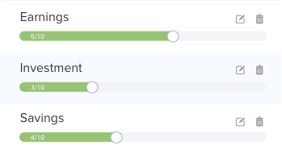

# Progress Range

The objective of this project is predominantly to style the ionic core `ion-range`
component within the `progress-range` component.

This component is used by the `sub-area-item` component which shouldn't require
much in the way of customization. However, it's been included to ensure that
the `progress-range` component works as expected in it's target context.

If it's required to tweak `sub-area-item` to make everything work as expected
so be it, but it's not ideal.
